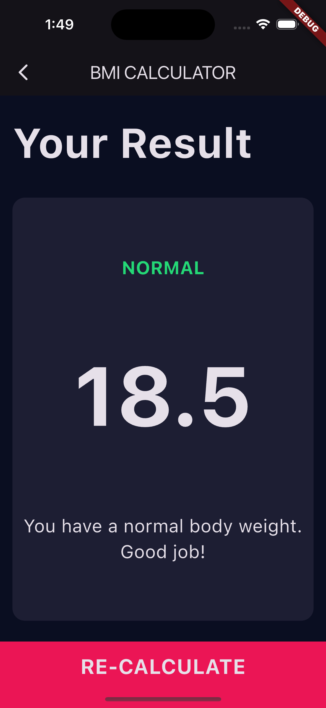

# BMI Calculator Flutter App

A simple BMI (Body Mass Index) calculator built using **Flutter**. This app allows users to input their weight and height, calculate their BMI, and see their BMI category.

This project was completed as part of [Angela Yu's Flutter Development Bootcamp](https://www.udemy.com/course/flutter-bootcamp-with-dart/) and serves as an introductory exercise to Flutter.

## Features

- Input weight and height.
- Calculate BMI with a single click.
- Display the BMI value along with the corresponding category (Underweight, Normal, Overweight, Obese).
- Simple, clean UI made with Flutter.

## Screenshots

Here are the screenshots of the app running:

 
 

## Getting Started

### Prerequisites

To get started, make sure you have **Flutter** installed on your machine. Follow the steps below:

1. Install **Flutter** by following the [official installation guide](https://flutter.dev/docs/get-started/install).
2. Make sure you have a working emulator or a physical device to run the app.

### Clone the repository
git clone https://github.com/yourusername/bmi-calculator-flutter.git

#### Navigate into the project
cd bmi-calculator-flutter

#### Get dependencies
flutter pub get

#### Run the app
flutter run

## 🎯 What I Learned
- Using Flutter widgets like **Column**, **Row**, **Expanded**, **Slider**, and **GestureDetector**  
- Creating **custom reusable widgets**  
- Managing state with **setState()**  
- Navigating between screens using **Navigator.push()** and **Navigator.pop()**  
- Writing simple **business logic in Dart**  

## 🙌 Acknowledgments
This project is part of **Angela Yu’s Flutter Development Bootcamp**.  
Special thanks to the instructor for her clear explanations and fun teaching style!

## 📜 License
This project is for **educational purposes only**.  
You are free to use and modify it for learning or personal projects.
